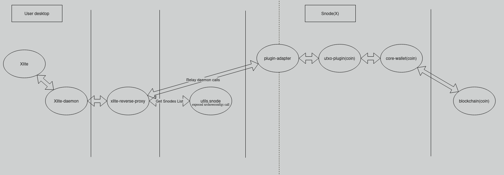

# xlite-reverse-proxy

Reverse proxy daemon to use as endpoint for xlite-daemon  
<https://github.com/blocknetdx/xlite-daemon>

This proxy relays requests from xlite-daemon to a list of backend service node servers, performing health checks and consensus validation to ensure reliable responses. It supports both **static** and **dynamic** server configurations.



---

## 🧱 Build Instructions

### Clone the Repository

```bash
git clone https://github.com/tryiou/xlite-reverse-proxy.git
cd xlite-reverse-proxy
```

### Install Dependencies

```bash
go get
```

### Build for Your Platform

- **Linux**:

  ```bash
  go build -o build/xlite-reverse-proxy_linux .
  ```

- **Windows**:

  ```bash
  go build -o build/xlite-reverse-proxy_windows.exe .
  ```

- **macOS**:

  ```bash
  go build -o build/xlite-reverse-proxy_macos .
  ```

### Run the Built Binary

- **Linux**:

  ```bash
  ./build/xlite-reverse-proxy_linux
  ```

- **Windows**:

  ```bash
  .\build\xlite-reverse-proxy_windows.exe
  ```

- **macOS**:

  ```bash
  ./build/xlite-reverse-proxy_macos
  ```

---

## 🚀 Usage

### Static Server Configuration

If the application is executed without any launch arguments, it will use the `servers_map` configuration as the static list of servers. This is the default behavior.

- `servers_map` defines a list of servers to use as remote endpoints.
- Each server entry must include:
  - `url`: The URL of the server (string).
  - `exr`: Whether the server is an EXR service node or an exposed 'plugin-adapter' endpoint (bool).

### Dynamic Server Configuration

If the application is executed with the `-dynlist=true` launch argument, it will use the `dynlist_servers_providers` URLs to fetch the `servers_map` dynamically. This allows the proxy to update its server list periodically from external providers.

- `dynlist_servers_providers` defines a list of remote URLs to fetch dynamic server lists from.

When `-dynlist=true` is enabled:

1. The proxy fetches the server list from each URL in `dynlist_servers_providers` every 5 minutes.
2. It uses the returned server list to replace the static `servers_map` configuration.

---

## 🛠️ Configuration

The proxy uses a configuration file `xlite-reverse-proxy-config.yaml`, which is auto-generated at first start and loaded on subsequent runs. The following parameters are defined in the configuration file:

### `dynlist_servers_providers` (Dynamic Servers List)

- **Purpose**: Define one or more remote URLs to fetch dynamic server lists from. Enabled with `-dynlist=true`, disabled by default.
- **Format**: List of strings (HTTP/HTTPS URLs).
- **Example**:

  ```yaml
  dynlist_servers_providers:
    - https://utils.blocknet.org
    - http://exrproxy1.airdns.org:42114
  ```

### `servers_map` (Static Servers List)

- **Purpose**: Define a static list of servers to use as remote endpoints. Used by default if `-dynlist=true` is not provided.
- **Format**: List of maps with keys:
  - `url`: (string) The URL of the server.
  - `exr`: (bool) Whether the server is an EXR service node or an exposed 'plugin-adapter' endpoint.
- **Example**:

  ```yaml
  servers_map:
    - url: http://exrproxy1.airdns.org:42114
      exr: true
    - url: http://127.0.0.1:5000/
      exr: false
  ```

### `accepted_paths` (Accepted API Paths)

- **Purpose**: Define the API paths the proxy will accept and relay to backend servers.
- **Format**: List of strings.
- **Example**:

  ```yaml
  accepted_paths:
    - /
    - /height
    - /heights
    - /fees
    - /ping
    - /servers
  ```

### `accepted_methods` (Accepted RPC Methods)

- **Purpose**: Define the RPC methods the proxy will relay to backend servers.
- **Format**: List of strings.
- **Example**:

  ```yaml
  accepted_methods:
    - getutxos
    - getrawtransaction
    - getrawmempool
    - getblockcount
    - sendrawtransaction
    - gettransaction
    - getblock
    - getblockhash
    - heights
    - fees
    - getbalance
    - gethistory
    - ping
  ```

### `max_stored_blocks` (Block Cache Size)

- **Purpose**: Maximum number of blocks to cache for validation purposes.
- **Format**: Integer.
- **Example**: `3` (caches up to 3 blocks per coin).

### `max_block_time_diff` (Time Difference Threshold)

- **Purpose**: Maximum allowed difference (in seconds) between the block time and the system time for a server to be considered healthy.
- **Format**: Integer.
- **Example**: `7200` (2 hours).

### `http_timeout` (HTTP Request Timeout)

- **Purpose**: Timeout (in seconds) for HTTP requests to backend servers.
- **Format**: Integer.
- **Example**: `8` (8 seconds).

### `rate_limit` (Request Rate Limit)

- **Purpose**: Maximum number of requests allowed per minute.
- **Format**: Integer.
- **Example**: `100` (100 requests/minute).

### `max_log_size` (Log File Size Limit)

- **Purpose**: Maximum size (in bytes) for the log file before it is rotated.
- **Format**: Integer.
- **Example**: `52428800` (50 MB).
